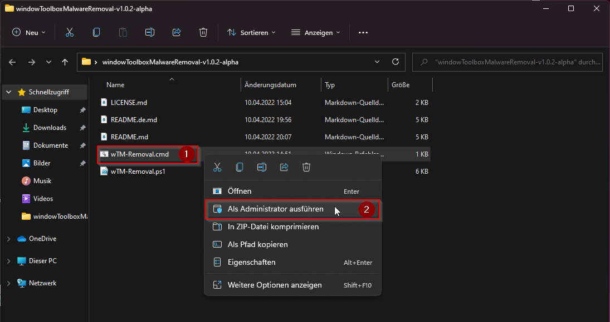
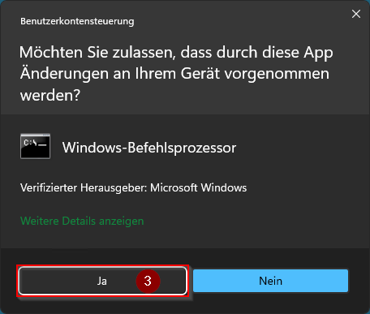
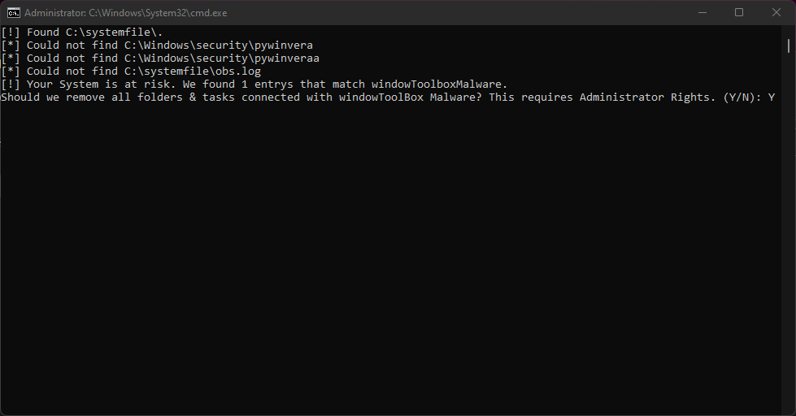
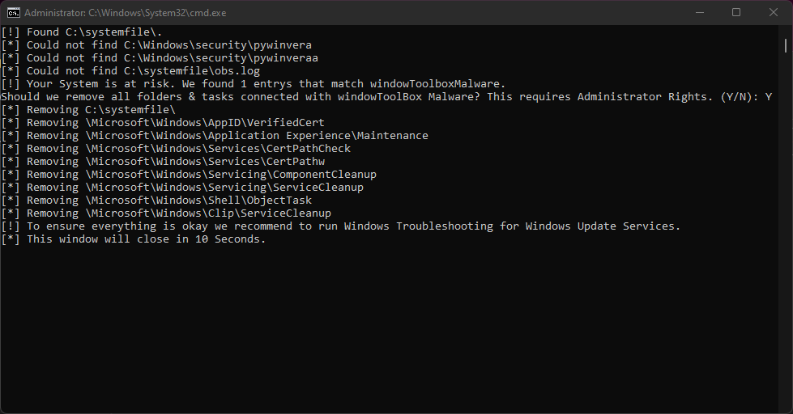
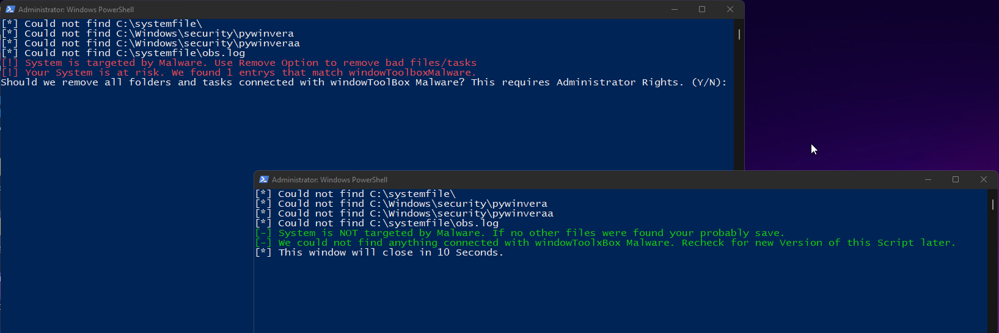
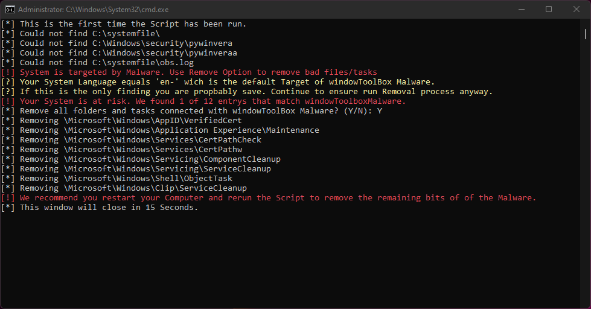

[Deutsche Version](https://github.com/pabumake/windowToolboxMalware-Removal/blob/main/README.de.md)

# 1. windowToolboxMalwareRemoval
[](https://microsoft.com/PowerShell)
[](https://opensource.org/licenses/MIT)


wTM-Removal searches and removes malicious files contained within windowstoolbox.

TLDR:
~~Please report this bad Repo: https://github.com/windowtoolbox/under_observation~~

Repo is gone. Thank you all for helping taking it down 👍
## 1.1 Contents

- [1. windowToolboxMalwareRemoval](#1-windowtoolboxmalwareremoval)
  - [1.1 Contents](#11-contents)
- [2. Usage](#2-usage)
  - [2.1 Differentiation between OS Languages](#21-differentiation-between-os-languages)
- [3. Combined Investigation Report from SemperVideo Discord Community](#3-combined-investigation-report-from-sempervideo-discord-community)
  - [3.1 Deobfuscated](#31-deobfuscated)
  - [3.2 Are you affected ?](#32-are-you-affected-)
  - [3.3 Why are only "en-" Users affected ?](#33-why-are-only-en--users-affected-)
- [4. Thanks to](#4-thanks-to)

# 2. Usage

1. Right Click on "wTM-Removal.cmd" <br>
2. "Run as Administrator"
3. Accept the UAC Prompt for Powershell <br>
4. On Removal request answer with Y/y -> Enter <br><br>
5. Reboot System, Rerun the Script once more.
6. On a third run the Script should display that there was nothing more found and exit after 10 Seconds.
7. Run Windows Troubleshooting for Windows Updates

The Malware maniupulates the Windows Update Service in some cases. This should prevent Windows Update to mess with the Malware and make it unusable.

## 2.1 Differentiation between OS Languages

To address the [Issue](https://github.com/pabumake/windowToolboxMalware-Removal/issues/8) I added a more clearer output on the Tool:
<br>


The Message is now to be differentiated in red/green and for our colorblind folks in [ ! ] / [ - ].<br>
Also we added Yellow for small explaination and [ ? ] for colorblind folks.
# 3. Combined Investigation Report from SemperVideo Discord Community

Malicious Script Suite this Discord-Server is about: https://github.com/windowtoolbox/powershell-windows-toolbox <br>
[Wayback Archive Link](https://web.archive.org/web/20220401004833/https://github.com/windowtoolbox/powershell-windows-toolbox) before the repository was changed.

Second Account used : https://github.com/alexrybak0444 <br>
This might be the original (unaffected) project: https://github.com/WinTweakers/WindowsToolbox <br>

Deleted issue in the original repository:<br>
[Wayback Archive Link](https://web.archive.org/web/20220409165432/https://github.com/windowtoolbox/powershell-windows-toolbox/issues/32) before the repository was changed.

## 3.1 Deobfuscated
All thanks to @ZerGo0 <br>
Stage 1: (@LinuxUserGD) <br>
https://gist.github.com/ZerGo0/aa0984800fd6da0a9d9e7842a0dc3645 <br>
[Stage 1: Explained](https://gist.github.com/ZerGo0/aa0984800fd6da0a9d9e7842a0dc3645?permalink_comment_id=4127278#gistcomment-4127278)

Stage 2: <br>
https://gist.github.com/ZerGo0/690175a1163bd4747d825491810c6ebb <br>
[Stage 2: Explained](https://gist.github.com/ZerGo0/690175a1163bd4747d825491810c6ebb?permalink_comment_id=4127295#gistcomment-4127295)<br>

Stage 3:
https://gist.github.com/ZerGo0/ce1d2786cdb5ecca248f309a98b1d987 <br>
     [Stage 3: Explained](https://gist.github.com/ZerGo0/ce1d2786cdb5ecca248f309a98b1d987?permalink_comment_id=4127311#gistcomment-4127311)

Showcase 1 (Gets stuck at Curl) <br>
https://app.any.run/tasks/40c113ab-7908-4979-8810-8733fd67bf3a/

Showcase 2 / (Progressing the Script by hand) <br>
https://app.any.run/tasks/b6f0d354-bce5-401a-b422-08d262b2be82/ 

## 3.2 Are you affected ?
To check if you are infected: <br>
Open PowerShell as Administrator
```
Get-WinSystemLocale
```

if "Name" start with "en-" <br>
Check for the rest, if not, then you are most likely safe. <br>

Do these folders exist?
```
C:\systemfile\
C:\Windows\security\pywinvera
C:\Windows\security\pywinveraa
```

Do these Tasks exist in Task Scheduler
```
Microsoft\Windows\AppID\VerifiedCert
Microsoft\Windows\Application Experience\Maintenance
Microsoft\Windows\Services\CertPathCheck
Microsoft\Windows\Services\CertPathw
Microsoft\Windows\Servicing\ComponentCleanup
Microsoft\Windows\Servicing\ServiceCleanup
Microsoft\Windows\Shell\ObjectTask
Microsoft\Windows\Clip\ServiceCleanup
```

Then you are affected!

## 3.3 Why are only "en-" Users affected ?
There is a check in Stage 3, where the bad stuff happens, here it checks for the SystemLocale if it is not "en-" it kills the cmd.exe, <br>
Which stops everything else (look at the first showcase linked above). <br>
On the right side you see the Processes, here if it reaches 560 cmd.exe it opens PowerShell with the check. <br>


The check fails (for us Germans, for example) and it kills itself. <br>
For others, the script just keeps going. <br>

# 4. Thanks to
@BlockyTheDev <br>
blubbablasen <br>
Kay <br>
@ThisLimn0 <br>
@LinuxUserGD <br>
Mikasa <br>
@OptionalM <br>
Sonnenläufer <br>
@Zergo0 <br>
@Zuescho <br>
<b>for Investigative Work & Reporting</b><br>

Cirno <br>
Harromann <br>
Janmm14 <br>
@luzeadev  <br>
XplLiciT <br>
<b>for Bugfixes, Testing and QoS improvements</b><br>

@Zeryther <br>
<b>for translating the README into German</b>

@pabumake
[](https://ko-fi.com/A0A7FA8GY)
